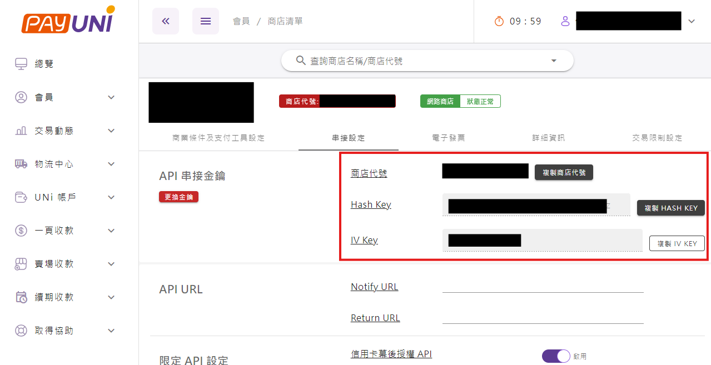

# PayUNi 統一金流

## <mark style="color:blue;">優惠費率申請</mark>

統一金流優惠費率 (國內卡一次付清2.4%)\
直接填寫 [**申請表單**](https://www.newpay.com.tw/forms/payment/) 即可

## <mark style="color:blue;">填完表之後</mark> 

1. 約2-3天就會收到驗證信，注意垃圾信箱，要**點擊裡面的連結完成驗證**
2. 會收到統一金流的預設帳密，登入後確認資料都有填寫，若有錯誤需要點重新審核
3. 收到正式審核完成的郵件通知，才能進行串接！

## <mark style="color:blue;">串接方法</mark>

1. 從**後台 / woocommerce / 好用版擴充**設定，啟用 **PayUNi 統一金流**
2. 從**後台 / woocommerce / 金流設定**，找到 PayUNi 統一金流，輸入串接資料 〔**商店代號、Hash Key、IV Key**〕
3. 在統一金流後台設定 IP 〔請見下方：統一金流 IP 設定方法〕
4. 從**後台 / woocommerce / 付款**，[設定金流 - 付款方式](../woocommerce-shang-dian-gou-wu-ju/she-ding-jin-liu-fu-kuan-fang-shi.md)

## <mark style="color:blue;">串接資料</mark>

登入統一金流後台 / 會員 / 商店清單 / 串接設定

<figure><figcaption></figcaption></figure>

## <mark style="color:blue;">統一金流 IP 設定方法</mark>

1. 登入統一金流後台 / 會員 / 商店清單 / 串接設定

<figure><figcaption></figcaption></figure>

2. 往下找到「**限定 API 之 IP 設定**」，輸入**主機 IP 地址**，並儲存

<figure><figcaption></figcaption></figure>

<mark style="color:blue;">**如何查找主機 IP 地址？**</mark>\ <mark style="color:blue;">**方法一：到您購買網站的網站商店，右上角“管理我的網站”**</mark>

<figure><figcaption></figcaption></figure>

<mark style="color:blue;">**方法二：到**</mark> [<mark style="color:blue;">**DNS檢查工具**</mark>](https://dnschecker.org/) <mark style="color:blue;">**輸入你的網址，查找Ａ紀錄就可以看到網站的IP位置囉**</mark> 

<figure><figcaption></figcaption></figure>
