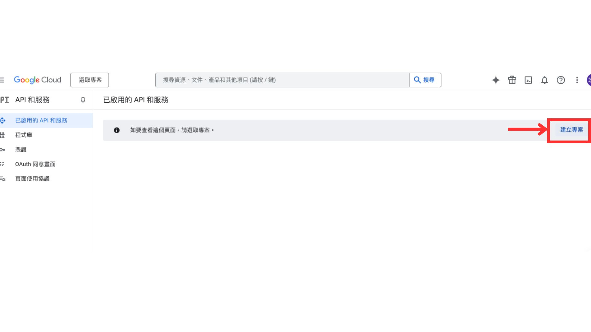
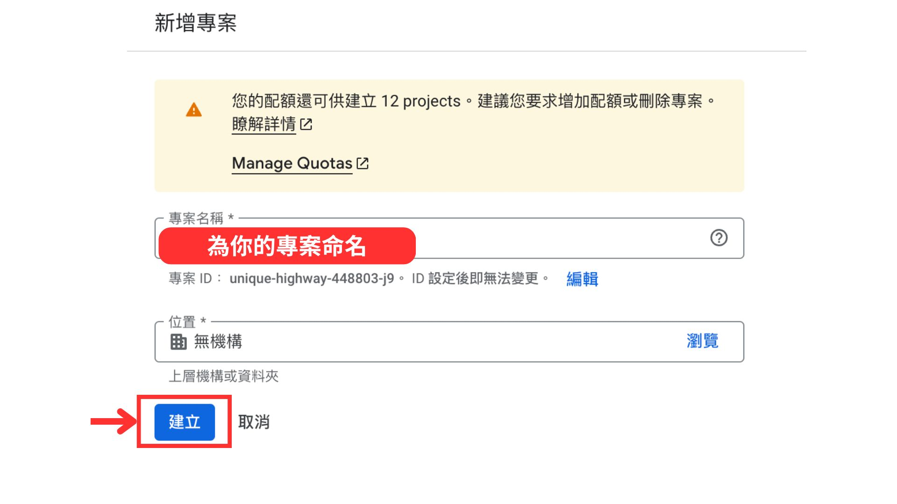
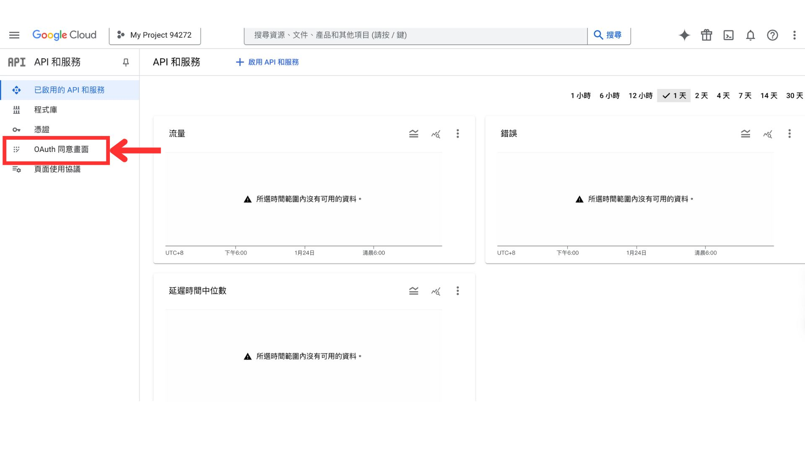
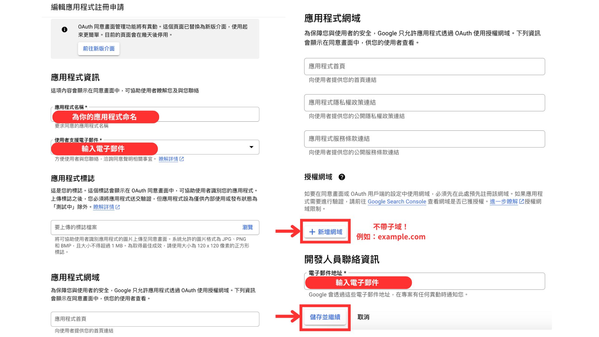
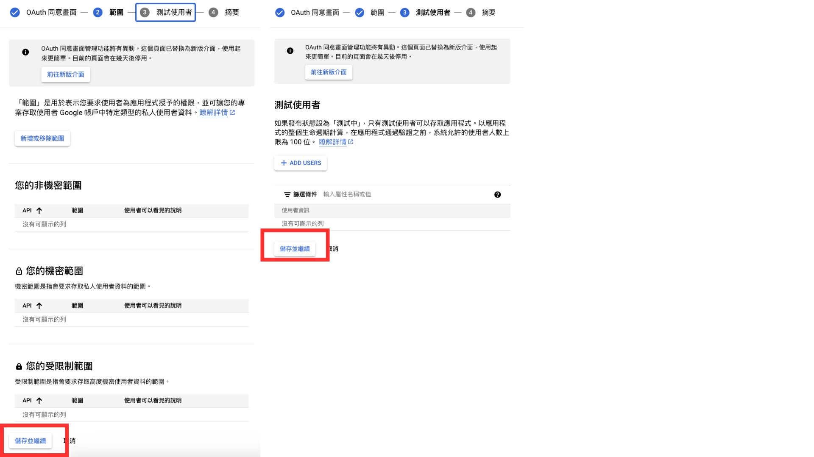

# 社群登入：使用 Nextend Social Login and Register 外掛


Line 登入需要付費版外掛 ，請自行到[這邊](https://nextendweb.com/social-login/?utm_campaign=nsl\&utm_source=buy-pro-addon-button-line\&utm_medium=nsl-wordpress-free)購買，並安裝外掛和授權


### 1. 安裝 Nextend Social Login and Register 外掛


[an-zhuang-wai-gua.md](../wordpress-kuai-su-ru-men/an-zhuang-wai-gua.md)


### 2. 選擇需要的社群登入開始設定

1. 從後台 / Nextend Social Login

<figure><figcaption></figcaption></figure>

2. 選擇要設定的社群，按 Getting Started

<figure><figcaption></figcaption></figure>

### 3-1. 如何啟用 Google 登錄

官方教學：[https://nextendweb.com/nextend-social-login-docs/provider-google/](https://nextendweb.com/nextend-social-login-docs/provider-google/)

官方教學影片：[https://www.youtube.com/watch?v=i01nbsbNMmw\&list=PLSawiBnEUNftt3EDqnP2jIXeh6q0pZ5D8\&index=3](https://www.youtube.com/watch?v=i01nbsbNMmw\&list=PLSawiBnEUNftt3EDqnP2jIXeh6q0pZ5D8\&index=3)

1. &#x20;點選 「 Getting Started 」 後會進入以下畫面，請依以下步驟進行設置：

<figure><figcaption></figcaption></figure>

2. 進入：[https://console.developers.google.com/apis/](https://console.developers.google.com/apis/) ，並登入
3. 如果還沒有專案，按下 **「 新建專案 」** 來執行此操作（如果已經有一個專案，在頂部欄中按兩下目名稱，會彈出一個模態框並按下 「新建專案 」 ）

<figure><figcaption></figcaption></figure>

4. 為專案命名，然後再次按下 **「 建立 」**&#x20;

&#x20;

<figure><figcaption></figcaption></figure>

5.建立專案後，會進入儀錶板。（ 如果之前已經有一個專案，請在頂部列中選擇已創建的專案)，點擊左側的 **「OAuth 同意畫面」**

<figure><figcaption></figcaption></figure>

6. 根據需要選擇使用者類型，然後按 「 建立 」  。如果您想為任何擁有 Google 帳戶的使用者啟用 Google登錄，請選擇 「 外部 」 選項！
7. 輸入以下，在 「授權網域」 下，按 **「新增網域」** 不要帶子域！例如：example.com，最後 **「儲存並繼續」**

<figure><figcaption></figcaption></figure>

8. 依序完成並按 **「儲存並繼續」**

<figure><figcaption></figcaption></figure>

9. 在左側選 「憑證」，然後按下 **「 +建立憑證 」** ，選擇 **「OAuth 用戶端 ID」**&#x20;

<figure><figcaption></figcaption></figure>

10. 在 「應用程式類型」 下選擇 **「網頁應用程式」** ，並為 OAuth 用戶端 ID 命名（僅供控制台查看）。

<figure><figcaption></figcaption></figure>

11. 按 **「+新增URL」** 按紐，貼上WP後台的 Nextend Social Login 找到後端建議的 URL，也就是  `https://你的網址/wp-login.php?loginSocial=google`，最後點擊 「建立」&#x20;

<figure><figcaption></figcaption></figure>

12. 完成後會跳出以下視窗，如果沒有請轉到左側列表的「用戶端」選擇您的應用程式查詢，複製 “**用戶端編號Client ID**” 和 “**用戶端密碼Client Secret**”

<figure><figcaption></figcaption></figure>

13. 將複製下來的“**用戶端編號Client ID**”和“**用戶端密碼Client Secret**” ，貼到ＷP後台的Settings中並按下 「儲存設定」&#x20;
14. 會跳出驗證對話框，再按下 **「Verify Settings」** 進行驗證

<figure><figcaption></figcaption></figure>

<figure><figcaption></figcaption></figure>

13. 按下左側的“**OAuth 同意螢幕**”，按 「**發佈應用程式」**&#x6309;鈕，然後按**確認**，完成：）

<figure><figcaption></figcaption></figure>

14. 啟用後，每次使用者使用 Google登錄時，Google 都會顯示帳戶選擇提示

<figure><figcaption></figcaption></figure>

## **3-2. 如何啟用 Line 登錄**


Line 登錄需要付費版外掛 ，請自行到[這邊](https://nextendweb.com/social-login/?utm_campaign=nsl\&utm_source=buy-pro-addon-button-line\&utm_medium=nsl-wordpress-free)購買，並安裝外掛和授權


1. 進入 [https://developers.line.biz/console/](https://developers.line.biz/console/)
2. 請使用**Line 企業帳號**登入，如果尚未註冊，點擊下方建立帳號。

<figure><figcaption></figcaption></figure> <figure><figcaption></figcaption></figure>

3. 進入登入畫面，按一下 「 **Create a new provider** 」 按鈕。填寫  **「 Provider name 」** 字段，然後按一下 **「 Create 」** 按鈕

<figure><figcaption></figcaption></figure>

<figure><figcaption></figcaption></figure>

4. 進入 **「 Channels 」** 面板，點選  「 **Create a LINE Login channel** 」   進行設定

<figure><figcaption></figcaption></figure>

5. 依序填寫，確保 Channel type : **LINE Login  /** App types  : **Web app**

&#x20;最後按下 **「 Create 」**

<figure><figcaption></figcaption></figure>

6. 頻道創建完成後，進入頻道面板，捲動到最下方 「 **OpenID Connect** 」，點擊 Email address permission 旁的 「 **Apply 」** 按鈕。填寫表格，然後按一下 **「 Submit 」** 按鈕。

<figure><figcaption></figcaption></figure>

7. 向上捲動至頁面頂部，進入 “LINE Login” 面版。 在 「 Callback URL 」 欄位中，填上在你的網站Nextend Social Login外掛設定中提供的 URL，也就是 `https://你的網址/wp-login.php?loginSocial=line`。

<figure><figcaption></figcaption></figure>

8. 在您的應用程式名稱下，點擊 「 Developing 」 按鈕發布頻道！

<figure><figcaption></figcaption></figure>

9. 回到 “Basic settings” 面版 “，找到 「 **Channel  ID** 」 和 「 **Channel secret** 」 值，填回你的網站後台Social Login and Register 外掛設置中

<figure><figcaption></figcaption></figure>

## 3-3. 如何啟用 Facebook 登錄

官方教學：[https://nextendweb.com/nextend-social-login-docs/provider-facebook/](https://nextendweb.com/nextend-social-login-docs/provider-facebook/)

官方教學影片：[https://www.youtube.com/watch?v=giHaGhjuh2A\&list=PLSawiBnEUNftt3EDqnP2jIXeh6q0pZ5D8\&index=2](https://www.youtube.com/watch?v=giHaGhjuh2A\&list=PLSawiBnEUNftt3EDqnP2jIXeh6q0pZ5D8\&index=2)

1. 進入[ https://developers.facebook.com/apps/](https://developers.facebook.com/apps/)
2. 按下 「建立應用程式」 按鈕
3. 填寫 「應用程式名稱」 和 「聯繫電子郵件」 欄位，並繼續下一步，最後按下確定

<figure><figcaption></figcaption></figure>

<figure><figcaption></figcaption></figure>

<figure><figcaption></figcaption></figure>

4. 成功建立應用程式後會進入主控版畫面，找到FB按下設定

<figure><figcaption></figcaption></figure>

5. 選擇 「**網站**」 ，並輸入你網站網址，記得按 “save”

<figure><figcaption></figcaption></figure>

<figure><figcaption></figcaption></figure>

6. 在WP網站後台>設定> Nextend Social Login>FB getting start 。找到**URL**，也就是 `https://你的網址/wp-login.php?loginSocial=facebook`，並複製貼到框選位置

<figure><figcaption></figcaption></figure>

<figure><figcaption></figcaption></figure>

7. 到應用程式設定>基本資料 填寫，完成後按下 「**上線**」 按鈕

<figure><figcaption></figcaption></figure>

8. 在應用程式的左側選中“基本資料”中找到**App ID 應用程式編號 和 App Secret 應用程式密鑰**，進入後台填入

<figure><figcaption></figcaption></figure>

9. 於後台完成設定

<figure><figcaption></figcaption></figure>

10. 最後按下 **「Eable**」 。當登錄畫面出現 FB登錄按鈕 即成功

<figure><figcaption></figcaption></figure>
