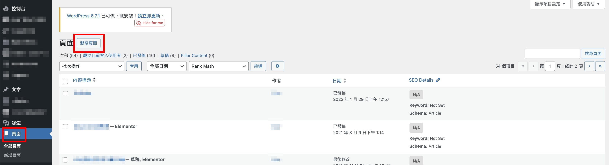
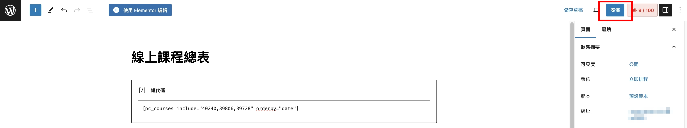

# 課程列表短代碼使用教學

## <mark style="color:orange;">什麼是課程列表短代碼?</mark>

課程列表是可以一次顯示所有課程的列表，

主要是讓人能在你的網站上，一次就瀏覽到所有的課程，

在你設好課程列表顯示的條件之後，只需要點擊複製按鈕，就能將代碼貼在任何頁面中，

系統會依照你設定的條件，自動抓取課程相關資訊並顯示在列表中，

這個讓你可 自定義課程列表顯示 的功能稱為 - **課程列表短代碼**。

<figure><figcaption></figcaption></figure>

## <mark style="color:orange;">怎麼取得短代碼？</mark>

1. 到Power Course後台 > 短代碼
2. 下圖紅框處可調整 課程列表 要顯示的條件\
   例如想要顯示哪幾個課程、排列順序依據、一列想顯示幾個課程..等


下方代碼會依據你所選的條件即時呈現，代碼都不相同


<figure><figcaption></figcaption></figure>

3. 點擊下圖紅框處最右邊的按鈕可複製整段代碼

<figure><figcaption></figcaption></figure>

## <mark style="color:orange;">短代碼設定方式</mark>

1. 先在Power Course中設定好條件

* **顯示數量** - 列表要顯示多少課程數量 
* **欄位**  - 一列要顯示幾個課程 
* **只包含指定課程** - 如果想顯示所有課程沒有要指定，此欄可跳過\
  &#x20;                               這裡可指定只顯示哪幾個特定課程，欄位的課程可以複選！ 
* **排序調整** - 可選擇排序要升序或是降序 
* **排序依據** - 選擇課程排列的順序要依據什麼，可以選擇用 發佈時間、修改時間、名稱、ＩＤ或是隨機 
* **商品分類** - 可抓出特定分類的課程\
  &#x20;                   例：有分類免費課程跟付費課程，只想顯示免費課程在列表中的話，就選擇免費課程的分類 
* **商品標籤** - 可讓抓出特定標籤的課程 

✳️小提醒：如果沒有編輯任何條件的話，短代碼不會生成\
&#x20;                   如課程列表沒有想指定的條件， 『排序依據』 的欄位可選 **隨機** ，下方就會出現短代碼囉

<figure><figcaption></figcaption></figure>

2. 將短代碼複製

<figure><figcaption></figcaption></figure>

2. 到WordPress後台創立一個頁面，頁面 > 新增頁面

<figure><figcaption></figcaption></figure>

3. 點擊選取 『短代碼』&#x20;

<figure><figcaption></figcaption></figure>

4. 將剛複製的短代碼貼入欄位中， 最後點擊右上角 **發佈** 按鈕

<figure><figcaption></figcaption></figure>

這樣就能輕鬆製做出一頁課程列表囉～ 

## <mark style="color:orange;">使用 Elementor 編輯課程列表頁</mark>

如果你想在 課程列表 的頁面中增加更多資訊，

例如想放一些學員購課好康、最新優惠等，

可以選擇 **使用 Elementor 編輯**&#x20;

<figure><figcaption></figcaption></figure>

進入 Elementor 編輯頁後，就可以任意編排你的課程列表頁囉！

<figure><figcaption></figcaption></figure>

> ### <mark style="color:orange;">編輯後的前台呈現範例圖</mark>

<figure><figcaption></figcaption></figure>
