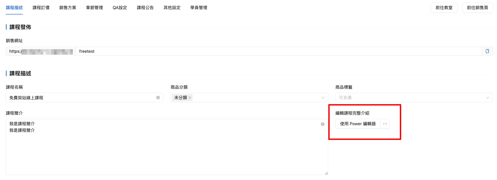

# 編輯課程頁面

想要設計獨特又美觀的課程頁面別擔心！

在Power Course課程系統中，我們提供了2種頁面編輯器

可依照你的需求擇一使用，

不管你是訴求版面簡單乾淨，或是想要複雜的排版細調，

這2種編輯器都能讓你容易做出理想的課程頁面。

1. 進入課程後台
2. 點擊 **課程列表**，點要編輯的 課程名稱
3. **課程描述** 能看到 『 編輯課程完整介紹 』 的地方，這裡就能編輯該課程的介紹了

<figure><figcaption></figcaption></figure>

編輯課程介紹共提供了２種編輯器：

### 一個是 **Power 編輯器**

介面類似 Notion 的操作，

如果沒有複雜的功能需求或是排版可用此編輯器

<figure><figcaption></figcaption></figure>

### &#x20;

### 一個是 **Elementor 編輯器**

更精緻，視覺化的操作，要使用這個編輯器照以下的圖做切換即可

✳️小提醒：點了之後會另開Elementor編輯視窗

<figure><figcaption></figcaption></figure>

<figure><figcaption></figcaption></figure>
