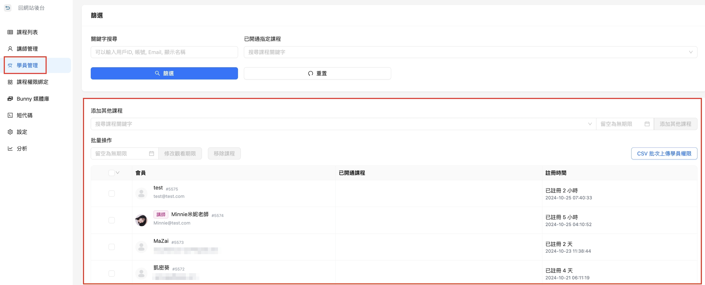
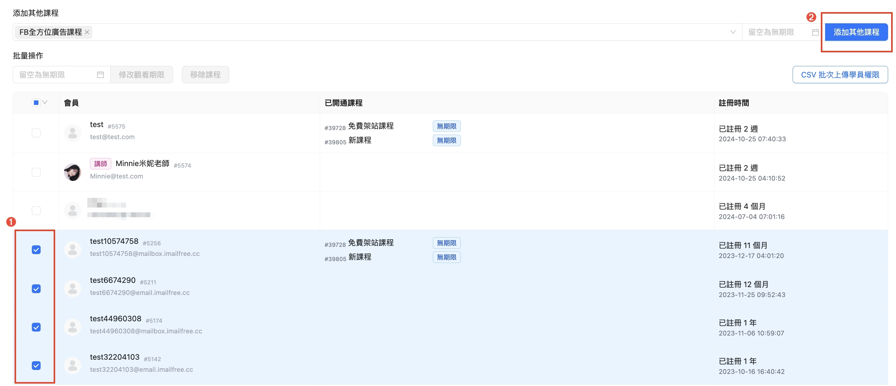
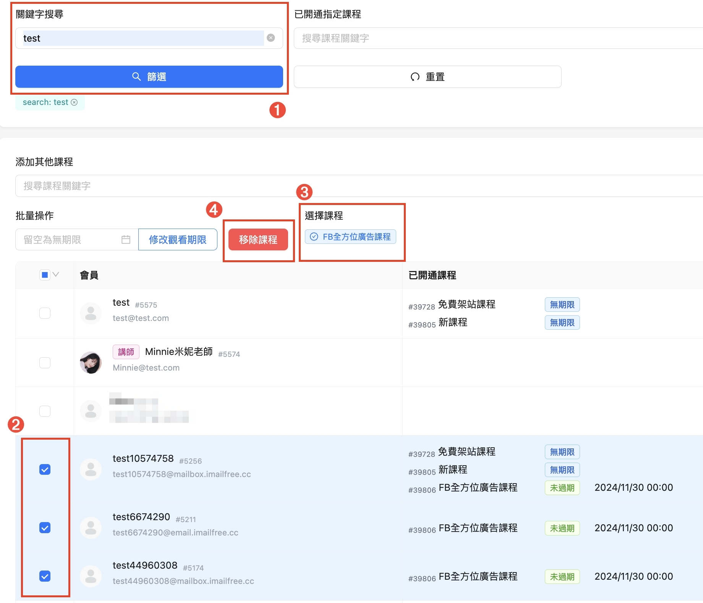
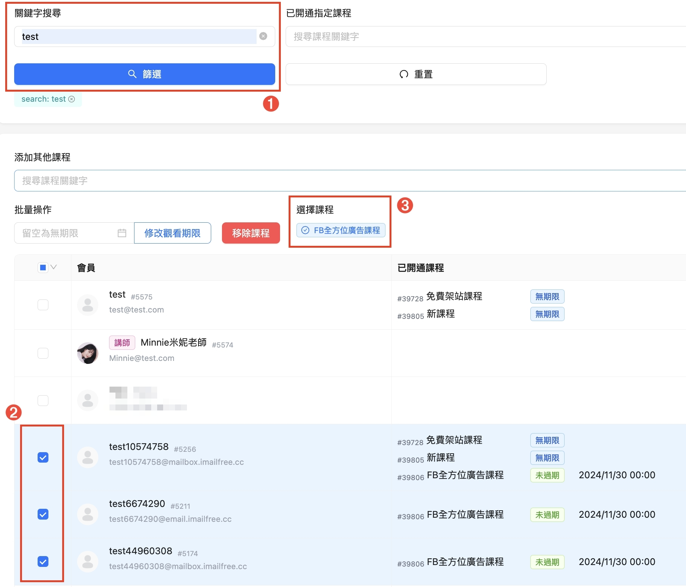

# 課程觀看期限與學員觀看期限設定

『課程的觀看期限』與『學員的觀看期限』是不同的喔！\
是各自獨立的設定\
\
**課程 觀看期限**是指 整個課程可觀看的期限\
**學員 觀看期限**是指 這個學員被指定可看該課程的時間段，例如30天、3個月、無限期等等

下面就來跟大家說明怎麼做設定

## <mark style="color:blue;">課程觀看期限</mark>

1. 進入課程後台
2. 點擊 **課程列表**，點要編輯的 課程名稱
3. **課程描述** 拉到下方能看到 『 課程資訊 』 的 **觀看期限**

觀看期限可選擇  『 無期限、固定天數、指定時間 』\
。無期限：如果不想限制課程期限的請選擇這個\
。固定天數：單位有日、月、年\
。指定時間：可選擇要在哪一天的幾點幾分到期

<figure><figcaption></figcaption></figure>

<figure><figcaption></figcaption></figure>

4. 設定完成後記得按 儲存 喔

## <mark style="color:blue;">學員觀看期限</mark>

想編緝學員可以看課程的期限是在 『學員管理』的介面中，不管是無期限或有期限都要透過這裡做設定喔！

共有 2 種編輯學員課程權限的方式：\
\
<mark style="color:red;">Ａ：只想針對單一課程，加入/移除學員觀看的權限</mark>\
進入課程列表 / **課程中的學員管理**做編輯\
這裡只會顯示出 已開通該課程 的學員名單\
\
<mark style="color:red;">Ｂ：想一次處理多個課程，加入/移除學員觀看的權限</mark>\
直接在課程後台 **左側的學員管理** 中做編輯\
網站上所有的學員都會顯示在這裡\
\
如果你想要一次大量(批次)加入或移除學員的看課權限或效期，請使用[<mark style="color:blue;">**Ｂ方法**</mark>](ke-cheng-guan-kan-qi-xian-yu-xue-yuan-guan-kan-qi-xian-she-ding.md#b)

### Ａ：針對單一課程，加入/移除學員觀看權限

1. 進入課程後台
2. 點擊 課程列表，點要編輯的 課程名稱

<figure><figcaption></figcaption></figure>

3. 點上方 **學員管理** ，下圖紅框處為課程權限的編輯區

<figure><figcaption></figcaption></figure>

### 加入學員觀看權限

1. 在新增學員的欄位中，搜尋要加入該課程權限的學員\
   ✳️小提醒：這裡可以同時搜尋＆選擇多位學員\
   ✳️小提醒：在還沒有選擇學員之前，新增學員的按鈕會是灰色不給點，有選學員之後，會自動轉成可點擊的藍色按鈕。 
2. 選擇完學員後，要點左側 **新增學員** 的藍色按鈕
3. 有新增完成的學員會出現在下方列表中

<figure><figcaption></figcaption></figure>

有在下方清單中看到剛新增的學員就代表設定成功囉。

### 移除學員觀看權限

1. 先勾選要移除的學員
2. 點右上方 **移除課程(移除學員)** 的按鈕

<figure><figcaption></figcaption></figure>

在下方清單中沒有出現就是已移除成功囉～

### 修改學員觀看權限

1. 先於下方清單中，勾選要修改的學員
2. 左上角日期欄位輸入到期日與時間\
   ✳️小提醒：如果要設為無期限，這個欄位留空就可
3. 日期與時間輸入好之後，點藍色的 『修改觀看期限』 按鈕

<figure><figcaption></figcaption></figure>

看看下方清單中剛編輯的學員，有跳出剛新設定的日期，就是有設定成功囉。

### Ｂ：一次將學員加入/移除 多個課程 的觀看權限 

這裡你可做到 『幫數個學員，同時增加/移除多個課程觀看權限』 ，也可 『幫已有特定課程的學員，增加更多不同課程的觀看權限』

更多教學連結：怎麼幫數個學員，同時增加/移除多個不同課程的觀看權限？

1. 進入課程後台 / 學員管理\
   下圖紅框處為課程權限的編輯區

<figure><figcaption></figcaption></figure>

### &#x20;

### 加入學員觀看權限(一次幫多個學員加入看課權限)

如有一批學員資料，可選擇使用 『CSV 批次上傳學員權限』 \
教學點這裡：[**怎麼批次匯入學員名單？**](/broken/pages/YxBEFOCeIQ0KcEs6lKAe)\
✳️小提醒：批次上傳請務必要用後台提供的 CSV 範例檔案格式 進行操作喔！

\
如果要處理的學員數量沒有到很多的話，可用以下方式操作

1. 在關鍵字搜尋欄位中，搜尋要增加學員的 用戶的ID / Email / 帳號 / 顯示名稱，任一個都行

<figure><figcaption></figcaption></figure>

2. 在 **添加其他課程** 欄位中，選擇要加入權限的課程

<figure><figcaption></figcaption></figure>

3. 下方清單中，勾選要加入該課程權限的學員
4. 點擊右上角的 **添加其他課程** 的按鈕就能新增完成囉！\
   ✳️小提醒：如果課程有觀看期限，要在按鈕左方的期限欄位中，填入看課到期日喔！

<figure><figcaption></figcaption></figure>

### &#x20;

### 移除學員觀看權限(一次幫多個學員移除看課權限)

1. 先搜尋要移除的學員
2. 勾選要移除的學員
3. 選擇課程 下，點擊該 課程名稱
4. 點 **移除課程** 的按鈕

<figure><figcaption></figcaption></figure>

### 修改學員觀看權限(一次幫多個學員修改看課權限)

1. 先搜尋要移除的學員
2. 勾選要移除的學員
3. 選擇課程 下，點擊該 課程名稱

<figure><figcaption></figcaption></figure>

4. 在 **課程期限** 的欄位中，選擇到期日後，點擊 **ＯＫ按鈕**
5. 最後點 **修改觀看期限** 的按鈕就完成囉！

<figure><figcaption></figcaption></figure>

