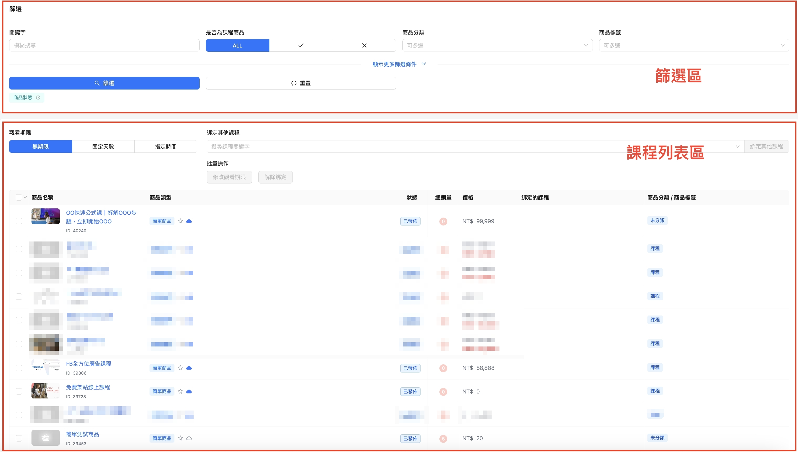
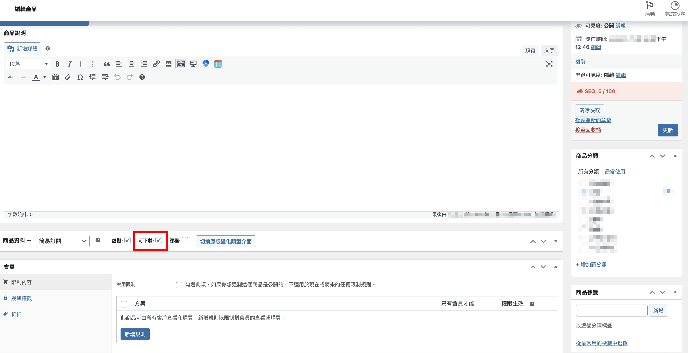
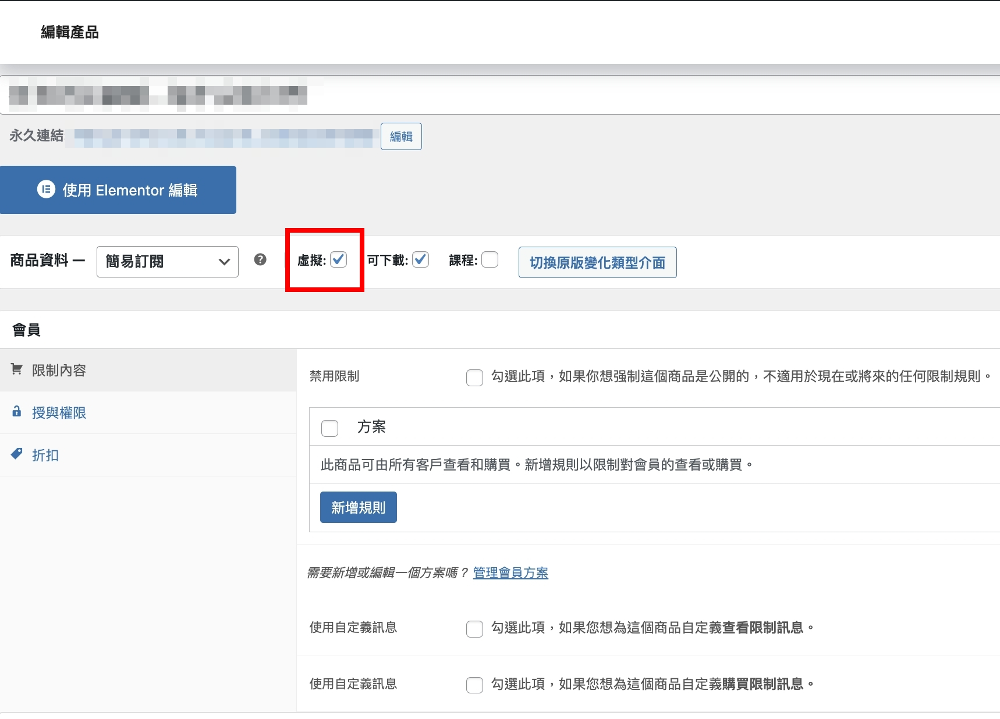
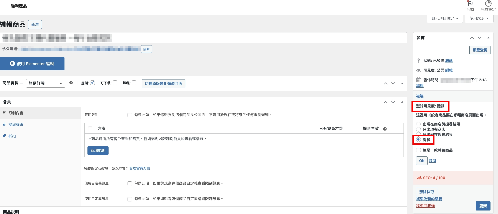

# 課程權限綁定功能簡介

**課程權限綁定** 這個功能主要是 『可將商品連動課程權限的自動開通』

例如只要購買 Ａ商品，就可開通ＯＯＯ課程的權限

課程類商品或非課程類商品都可自由的綁定

從此你再也不需要到ＷＰ後台，繞來繞去的設定

直接在 **課程權限綁定** 的介面中就可搞定！\
 

如果你想直接去看怎麼綁定的教學，可點下方教學連結：\
❯❯ [如何將商品綁定課程? 購買指定商品就開通指定課程](https://docs.wpsite.pro/powercourse/ke-cheng-quan-xian-bang-ding/shi-ti-shang-pin-+-xian-shang-ke-cheng-zi-dong-bang-ding-kai-tong)

接下來就要來跟大家說明 **課程權限綁定的介面功能**

### <mark style="color:orange;">整體介面</mark>

共分為2大區塊，一區是 篩選，一區是 商品列表區

<figure><figcaption></figcaption></figure>

下面會分2區做說明

### <mark style="color:blue;">篩選</mark>

<figure><figcaption></figcaption></figure>

1. **關鍵字** -  此處可輸入例如課程名稱做搜尋 
2. **是否為課程商品** - 可選擇下方的列表要顯示哪些商品\
   ALL 顯示所有商品、✓ 只顯示課程商品、✗ 不顯示課程商品 
3. **商品分類** - 可選擇要篩選哪個類別的商品，這邊會列出所有已創建過的分類\
   並支援可 同時選擇多個分類 做篩選\
   \
   ❯❯ [分類 / 標籤 怎麼建立  點我去看教學](../ke-cheng-guan-li-she-ding/ke-cheng-fen-lei-biao-qian.md)

 

4. **商品標籤** - 可選擇要篩選有哪些標籤的商品，這邊會列出所有已創建過的標籤\
   \
   ❯❯ [分類 / 標籤 怎麼建立  點我去看教學](../ke-cheng-guan-li-she-ding/ke-cheng-fen-lei-biao-qian.md) 
5. **精選商品** - 可選擇下方的列表是否要顯示出精選商品 
6. **可下載** - 可選擇下方的列表是否要顯示出 有勾選可下載的商品


可下載是在哪裡勾選？

在WordPress後台， 商品 > 編輯商品 中，商品資料的 可下載 打勾


<figure><figcaption></figcaption></figure>

7. **虛擬商品** - 可選擇下方的列表是否要顯示出虛擬商品


是否為虛擬商品是在哪裡勾選？

在WordPress後台， 商品 > 編輯商品 中，商品資料的 虛擬 打勾


<figure><figcaption></figcaption></figure>

8. **單獨販售** - 可選擇下方的列表是否要顯示出 隱藏於型錄的商品


隱藏於型錄的商品是在哪裡設定？

在WordPress後台， 商品 > 編輯商品 中，型錄可見度 > 隱藏  > OK\
設定好後，此商品就為 單獨販售 範圍中的商品了。


<figure><figcaption></figcaption></figure>

<figure><figcaption></figcaption></figure>

9. **商品狀態** - 下方的列表是否顯示出 特定狀態 的商品\
   可篩選的商品狀態包含 **已發佈、送交審閱、草稿、私密**\
   並支援可 同時選擇多個狀態 做篩選，例如可同時複選 草稿、私密 的商品做篩選 
10. **允許延期交貨** - 下方的列表是否顯示出 特定交貨狀態 的商品\
    可篩選的商品狀態包含 **允許、不允許、只有缺貨時允許**\
    並支援可 同時選擇多個狀態 做篩選 
11. **庫存狀態** - 下方的列表是否顯示出 特定庫存狀態 的商品\
    可篩選的商品狀態包含 **有庫存、缺貨、預定**\
    並支援可 同時選擇多個狀態 做篩選 
12. **商品發佈日期** - 此處可依照商品的發佈時間做搜尋 
13. **貨號** - 此處可輸入商品的代碼做搜尋

### <mark style="color:blue;">商品列表區</mark>

<figure><figcaption></figcaption></figure>

1. **觀看期限** - 要綁定給商品的課程要給多久的觀看期限 
2. **綁定其他課程** - 此處點一下會出現所有課程的下拉選單，或也可輸入課程名稱做搜尋\
   支援可同時複選多個課程 
3. **批量操作** - 這裡是針對 已綁定過 的商品才能做的編輯\
   ✳️小提醒：如沒有勾選已綁定過課程的商品＆選擇課程，這裡無法點擊是正常的喔

\
\
❯❯ [如何將商品綁定課程? 購買指定商品就開通指定課程](shi-ti-shang-pin-+-xian-shang-ke-cheng-zi-dong-bang-ding-kai-tong.md)
