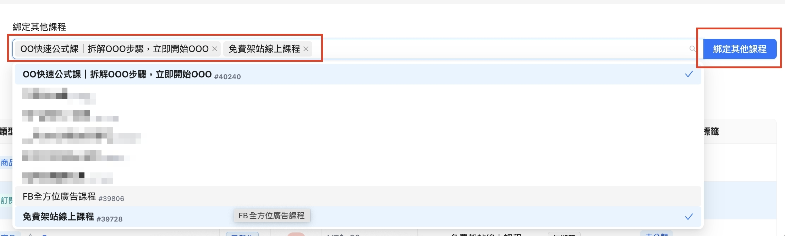

# 實體商品+線上課程自動綁定開通

目前 『簡單商品』跟『簡易訂閱型』 的商品都可綁，

<mark style="color:orange;">一個商品可綁一個以上的課</mark>，

綁定之後，只要購買該商品，購買完成後系統就會自動開通綁定課程的看課權限。

例如你有一個 臉部護膚禮盒 的實體商品，

你想送有購買 臉部護膚禮盒 這個實體商品的客人，可以有3天的期限，能看 『30分鐘學會化韓星妝容』 的課程影片

那就可透過 【課程權限綁定】 來達成喔！

## <mark style="color:orange;">課程權限綁定-怎麼將商品跟課程綁定？</mark>

設定邏輯是要 『先選商品』，其次才是選 『要綁定的課程』。\
&#x20;

1. 點擊左側選單的 **課程權限綁定**
2. 下圖的商品列表中，打勾要綁課程的 **商品**\
   ✳️小提醒：可同時勾選多個商品，換頁也不會掉（不會換一頁就都要重新勾選）\
   &#x20;
3. 再來設定欲綁定課程的 **觀看期限**\
   此為學員購買此商品後，綁定的課程可有多久的觀看期限\
   &#x20; \
   固定天數單位有日、月、年\
   指定時間的選項則可選擇要在哪一天的幾點到期

<figure><figcaption></figcaption></figure>

4. 參考下圖，這步要來選擇要給商品綁哪個課程：\
   綁定其他課程的欄位 「點一下」 會出現下拉選單，這裡 **選擇要綁定哪門課程**\
   ✳️小提醒：可同時勾選多門課程做綁定 
5. 最後點右方 **綁定其他課程** 的確認按鈕，即可完成商品與課程的綁定

<figure><figcaption></figcaption></figure>

## <mark style="color:orange;">怎麼移除綁定的課程？</mark>

1. 在 **課程權限綁定** 的商品列表中，打勾要移除課程權限的 **商品**\
   ✳️小提醒：可同時勾選多個商品，換頁也不會掉（不會換一頁就都要重新勾選） 
2. 選擇課程下方會 「自動跳出」  上一步我們勾選的商品中有包含的課程，點擊要移除的 **課程名稱**
3. 最後點擊 **解除綁定** 按鈕就可移除完成了

<figure><figcaption></figcaption></figure>

## &#x20;

## <mark style="color:orange;">怎麼調整已綁定課程的觀看期限？</mark>

1. 在 **課程權限綁定** 的商品列表中，打勾要調整的 **商品**\
   ✳️小提醒：可同時勾選多個商品，換頁也不會掉（不會換一頁就都要重新勾選） 
2. 選擇課程欄位下方會 「自動跳出」 已勾選商品中有的課程，點擊要調整觀看期限的 **課程名稱**
3. 到觀看期限的地方設定 無期限/固定天數/指定時間
4. 點擊 修改觀看期限 的按鈕即可完成

<figure><figcaption></figcaption></figure>
