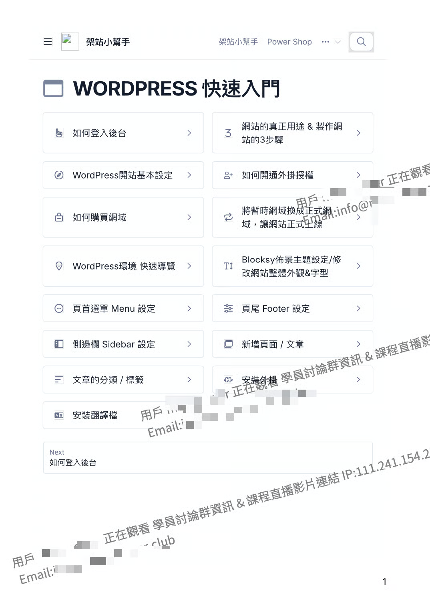

# PDF 講義浮水印設定

設定浮水印這個功能可大幅降低你辛苦製作好課程講義的外流風險！

PowerCourse的 「 影片浮水印 」 功能預設會自動抓取用戶的Email與名稱

當學員下載章節中的ＰＤＦ檔時

下載的檔案中會顯示該學員註冊的Email與名稱作為浮水印喔！ 

> 浮水印示意圖 ▼\
> 

## &#x20;

## <mark style="color:orange;">怎麼建立ＰＤＦ的動態浮水印？</mark>

* 從 Power Course 的後台 「 設定 」 >  「 一般設定 」 裡調整

<figure><figcaption></figcaption></figure>

## <mark style="color:orange;">浮水印設定方式</mark>

* **浮水印數量** - 設定文件中要顯示多少浮水印數量

&#x20;      浮水印數量會建議數值設定在3\~10內即可，太多的話會影響內文的閱讀性

* **浮水印文字** -  這裡可以調整浮水印顯示的文字，預設會帶入用戶的名稱與Email代碼


注意此處如要換行，換行代碼需使用 \n ，不是\ 喔


<figure><figcaption></figcaption></figure>

* **浮水印顏色** -  設定浮水印顯示的顏色

&#x20;      預設會是透明，點開後可編輯想要顯示的 「 顏色 」 跟 「 透明度 」 喔



<figure><figcaption></figcaption></figure>

### <mark style="color:blue;">查看浮水印效果</mark>

* 設定完後，會套用到全部課程 「 章節 」 中的所有ＰＤＦ檔案
* 設定完後，記得重整一下頁面 🔄\
  系統會花一點時間寫入，如看到 「 此 PDF 還在處理中 」 字樣就是正在寫入中，等一陣子再回來重整頁面就能看到浮水印了
* 浮水印的位置是隨機的，每次下載浮水印出現的位置都會不一樣喔

<figure><figcaption></figcaption></figure>
