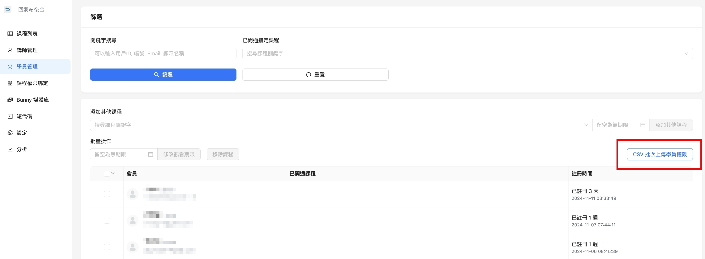
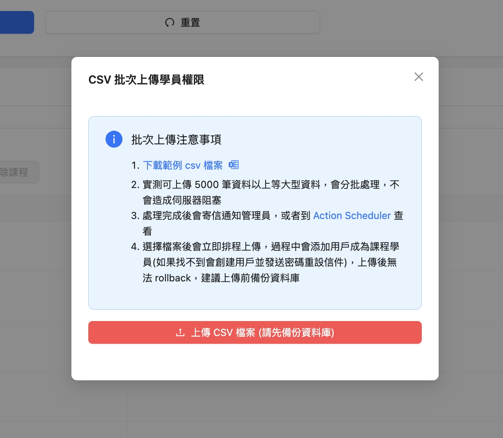

# 批次匯入學員名單

如果你已經有了一批學員名單，想將他們一次匯入到指定課程並開通課程權限，

你不需要再辛苦的一個個上傳了！

有了Power Course的 『批次匯入』 功能，不用再花費大把時間，一個一個建立學員名單，

直接在我們提供的 excel 檔中編輯完學員資訊後，再上傳ＣＳＶ檔案就能創建完成！

1. 進入課程後台
2. 點擊左側 **學員管理，**&#x53EF;看到右側的 **CSV批次上傳學員權限** 的按鈕

<figure><figcaption></figcaption></figure>

3. 點按鈕後，會出現CSV上傳範例的檔案按鈕（如下圖）
4. 點擊 下載範例 csv 檔案
5. 依照範本修改後再上傳即可

✳️小提醒：注意點擊上傳後無法取消上傳，建議上傳前先備份資料庫

<figure><figcaption></figcaption></figure>

✳️小提醒：

1. 實測可上傳 5000 筆資料以上等大型資料，會分批處理，不會造成伺服器阻塞
2. 上傳的檔案處理完成後，會寄信通知管理員，或者到 [Action Scheduler](https://morepower.club/wp-admin/admin.php?page=wc-status\&tab=action-scheduler\&s=pc_batch_add_students_task) 查看
3. 選擇檔案後會立即排程上傳，過程中會添加用戶成為課程學員(如果找不到會創建用戶並發送密碼重設信件)

