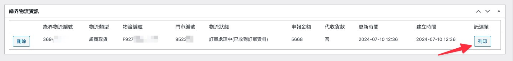

# 出貨流程 / 訂單狀態的意思



### <mark style="color:blue;">列印託運單(單張)</mark>

在個別的訂單裡面，可以找到像是這樣的框框，點擊列印，即可用一般的印表機印出託運單，貼在箱子上即可出貨

<figure><figcaption></figcaption></figure>

### <mark style="color:blue;">列印託運單(批次列印)</mark>

在訂單列表上，打勾要列印的訂單，批次選擇對應的物流

不同的物流方式，需要分批處理

<figure><figcaption></figcaption></figure>
